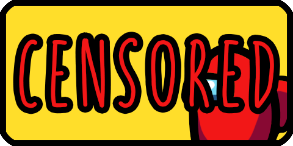

# (Example) Automatic Lobby Code Censor


## How this works

AmongUsOverlay allows you to specify a specific class for any tags in HTML, and make that tag visible only in a specific phase.

In this example, the following tag makes the `` visible only in the lobby, thereby making the image that hides the lobby code visible only in the lobby.

```html
<!-- Lobby code censor -->

```

## Ideas to Customize This Example

* Replace `assets/censored.png` with your own image
* Change the size of the image using `css/custom.css`

## OBS Configuration for This Example

| Key | Value |
|-|-|
| Source | Browser |
| URL | `http://localhost:42080/example-auto-lobbycode-censor/` |
| Width | `480` |
| Height | `240` |
